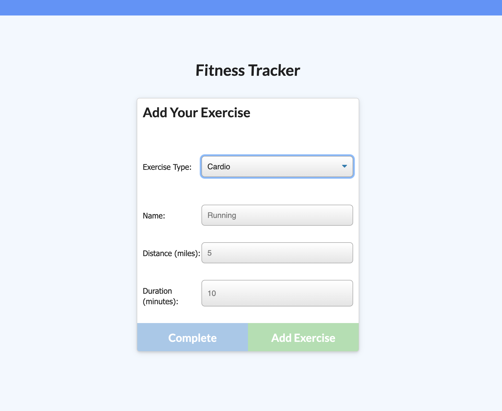
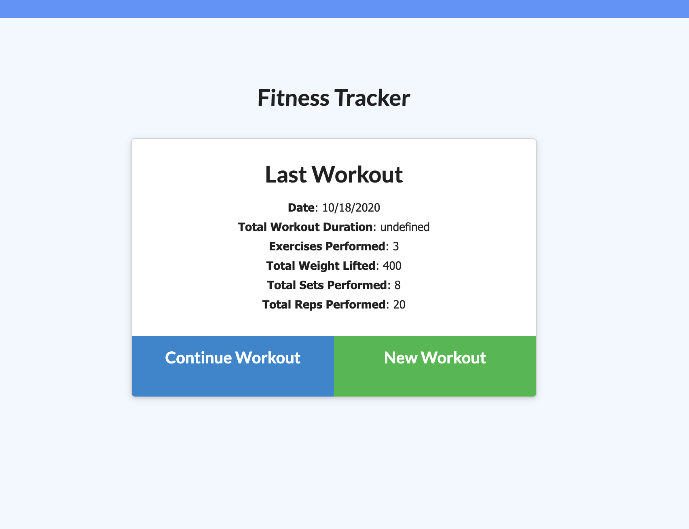
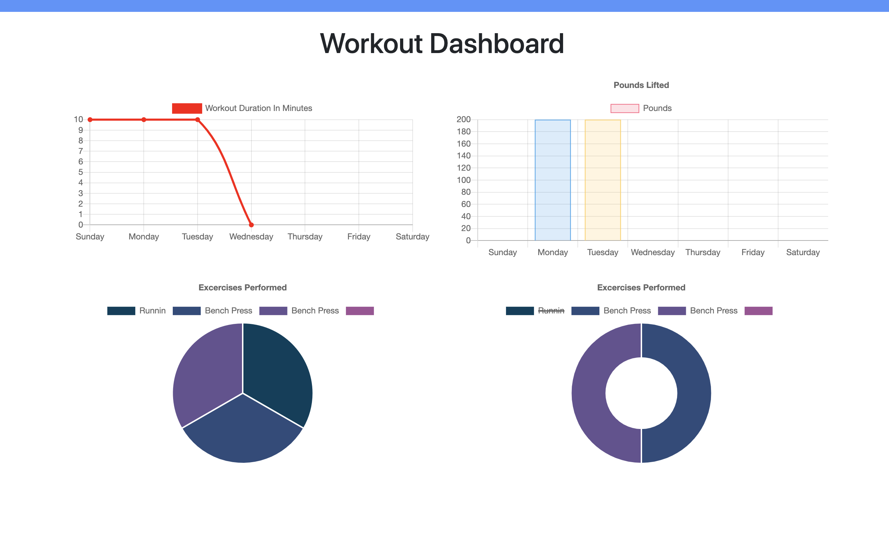

# Workout_Tracker

[](https://opensource.org/licenses/MIT)

## Acceptance Criteria

When the user loads the page, they should be given the option to create a new workout or continue with their last workout.

The user should be able to:

  * Add exercises to a previous workout plan.

  * Add new exercises to a new workout plan.

  * View the combined weight of multiple exercises on the `stats` page.

## Description

This application is a workout tracker that allows users to track current workouts and view them as a data set to track progress over time.

## Table of Contents

- [Workout_Tracker](#workout_tracker)
  - [Acceptance Criteria](#acceptance-criteria)
  - [Description](#description)
  - [Table of Contents](#table-of-contents)
  - [Usage](#usage)
  - [Built With](#built-with)
  - [License](#license)
  - [Contributing](#contributing)
  - [Testing](#testing)
  - [Contact](#contact)
  - [Acknowledgements](#acknowledgements)

## Usage

```
As a user, I want to be able to view create and track daily workouts. I want to be able to log multiple exercises in a workout on a given day. I should also be able to track the name, type, weight, sets, reps, and duration of exercise. If the exercise is a cardio exercise, I should be able to track my distance traveled.
```

View the deployed heroku application [here](https://hidden-coast-17443.herokuapp.com/).







## Built With

- node.js
- MongoDB
- Mongoose

## License

[MIT](LICENSE)

## Contributing

To contribute to this project create a branch with the feature or correction then submit a pull request.

## Testing

No tests have been created for this application at this time.

## Contact

Please direct any questions or concerns directly to me via my email address listed below.

- Github: [relizabet](https://github.com/relizabet)
- Email: rachel@relizabeth.com

## Acknowledgements

- Giphy Capture
- Canva
